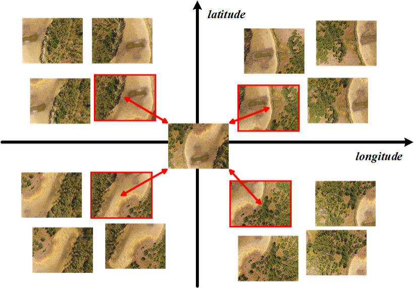
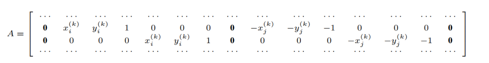

# Efficient-Superpixel-based-Large-scale-Image-Stitching(Registration-Part)
## Algorithm details
Our global registration optimization method has two main steps: feature matching and transformation optimization.

1) **Feature matching**

For each image, we select its 4 nearest neighbors based on GPS coordinates. Specifically, as shown in following figure, we define a coordinate system centered on each image using latitude and longitude as axes. These axes divide the coverage area into 4 equal-sized zones. To ensure registration quality across all orientations and avoid selecting multiple neighbors from a single direction, we choose the closest neighbor from each zone.Following figure illustrates that each image can have up to 4 pairs of neighboring images. Subsequently, redundant neighboring images are removed. And we apply the Scale Invariant Feature Transform (SIFT) algorithm to perform feature matching and the Random Sample Consensus (RANSAC) algorithm to eliminate outliers for each pair of neighboring images.

2) **Transformation optimization**

Assuming a total of N images to be stitched. Let *Ii* be the ith image (i = 1, · · · , N) and *Ti* be its affine transformation matrix, which is 2 × 3 matrix. To ensure aligned images are geometrically consistent, the location of transformed matching points should be close in global coordinate system. Thus, we use coordinates of matching points to construct our linear registration optimization function.

For a matching image pair (*Ii*, *Ij*), the following two equations can be constructed using the homography model:

*[xi(k), yi(k), 1]* $\cdot$ *Ti1* = *[xj(k), yj(k), 1]* $\cdot$ *Tj1*

*[xi(k), yi(k), 1]* $\cdot$ *Ti2* = *[xj(k), yj(k), 1]* $\cdot$ *Tj2*

where (*xi(k)*, *yi(k)*) denotes the coordinate of the kth matching point in image *Ii* and *Tir* represents the rth row of Ti (i.e., r = (1, 2)).

By stacking above equations for all the matching image pairs, the optimal affine transformation problem can be formulated as

*AX = 0*

where *A* and *X* are constructed as following, respectively.

*X = [T11, T12, ..., TN1, TN2]T*

Subsequently, the optimal affine transformation can be determined by employing linear least square algorithm to solve *AX = 0*.

