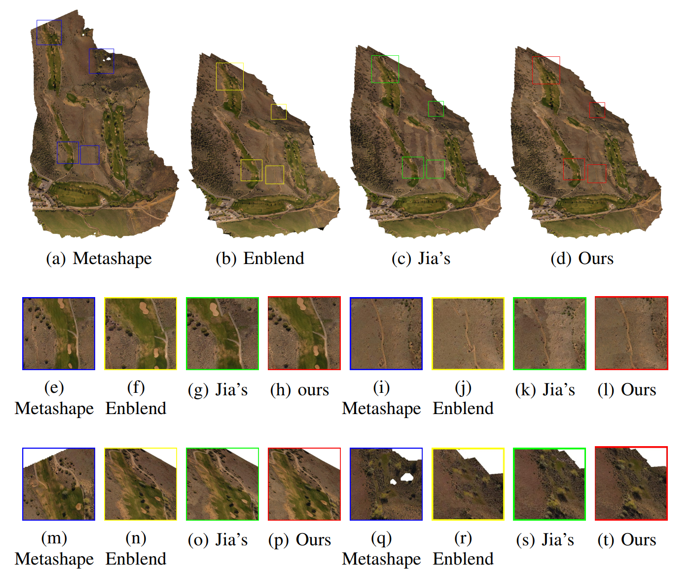

# Efficient Superpixel-based Seamline Detection for Large-scale Image Stitching
A novel method for stitchig large-scale high resolution images with robust registration and efficient graph-cut.
You can find our paper [here](https://ieeexplore.ieee.org/document/10912483).


# Registration Performance
## Dataset details
We evaluate our algorithm on 5 image datasets, which are all captured by Phantom 3 Advanced drone with resolution of 4000 × 3000 and available in Dronemapper website[6]. We also propose an efficient matching image pair selection method. The image number and selected image pair number is shown following.

<table style="width:100%">
  <tr>
    <th>Dataset</th>
    <th>Number of images</th>
  </tr>
   </tr>
  <tr>
    <td>Gregg</td>
    <td>187</td>
  </tr>
  <tr>
    <td>Golf Course</td>
    <td>664</td>
  </tr>
  <tr>
    <td>4thAveReservoir</td>
    <td>82</td>
  </tr>
  <tr>
    <td>AdobeButtes1</td>
    <td>160</td>
  </tr>
  <tr>
    <td>AdobeButtes2</td>
    <td>371</td>
  </tr>
</table>

# Efficiency Performance
We leverage the benefits of superpixels while significantly reducing the optimization vertices and enhancing the blending efficiency (refer following Table). And our superpixel-level energy function help our method find the global seamline (refer detailed comparison in our paper).

We implement Jia’s [5] two-image graph-cut algorithm with frame-to-frame strategy for comparison, which estimates seamline between current composite mosaic and newly introduced image. Additionally, we introduce Enblend [4], an efficient open-source software developed in C++, which enables the construction of a seamline network using frame-to-frame strategy, for further comparison.
And MetaShape is used for comparison again.
## Blending performance (running time) 
<table style="width:100%">
  <tr>
    <th>Dataset</th>
    <th>Metashape</th>
    <th>Jia's (frame-to-frame implementation)</th>
    <th>Enblend</th>
    <th>Ours (S=10000)</th>
    <th>Ours (S=20000)</th>
  </tr>
   </tr>
  <tr>
    <td>Gregg</td>
    <td>42m45s</td>
    <td>18m11s</td>
    <td>8m4s</td>
    <td>4m38s</td>
    <td><b>3m51s</b></td>
  </tr>
  <tr>
    <td>Golf Course</td>
    <td>2h28m58s</td>
    <td>1h14m4s</td>
    <td>30m46s</td>
    <td>13m1s</td>
    <td><b>7m38s</b></td>
  </tr>
  <tr>
    <td>4thAveReservoir</td>
    <td>17m3s</td>
    <td>6m16s</td>
    <td>4m19s</td>
    <td>2m23s</td>
    <td><b>1m28s</b></td>
  </tr>
  <tr>
    <td>AdobeButtes1</td>
    <td>29m45s</td>
    <td>8m9s</td>
    <td>7m42s</td>
    <td>2m14s</td>
    <td><b>2m1s</b></td>
  </tr>
  <tr>
    <td>AdobeButtes2</td>
    <td>1h14m6s</td>
    <td>39m40s</td>
    <td>16m27s</td>
    <td>9m6s</td>
    <td><b>6m20s</b></td>
  </tr>
</table>

## Visual comparison


# Cite our paper
If you find this method and the paper interesting and useful for your research, please cite our paper using 
```
@ARTICLE{Wang2025GRSL,
  author={Wang, Zhongxing and Fu, Zhizhong and Xu, Jin},
  journal={IEEE Geoscience and Remote Sensing Letters}, 
  title={Efficient Superpixel-based Seamline Detection for Large-scale Image Stitching}, 
  year={2025},
  volume={},
  number={},
  pages={1-1},
  keywords={Optimization;Image stitching;Image segmentation;Image color analysis;Complexity theory;Minimization;Autonomous aerial vehicles;Remote sensing;Labeling;Costs;Multiple image stitching;seamline detection;superpixel segmentation;multi-label optimization;unmanned aerial vehicle (UAV) image},
  doi={10.1109/LGRS.2025.3548266}}


```

# How to use our code
## Data
You can use UAV image dataset from Dronemapper website [at this link](https://dronemapper.com/sample_data/) or your own dataset with GPS information to test our code.

## Requirements and Installation
Our code is implemented on a linux system.
In order to run our code, you need to make sure that you have all the required python packages and enough RAM. 
You can find the list of packages we installed on our conda environment at [this text file](requirements.txt). 
It is very important to install the same versions of some of these packages in order for the code to run.

## Running
Set "images_path" in the [Main.py](py/Main.py) with your dataset path (make sure that there are only images in your folder and the image has GPS information).
Then, set your configuration in the [Settings_manager.py](py/Settings_manager.py) and run [Main.py](py/Main.py).

# Reference

1. Ruiz, J.J., Caballero, F., & Merino, L. (2018). MGRAPH: A Multigraph Homography Method to Generate Incremental Mosaics in Real-Time From UAV Swarms. IEEE Robotics and Automation Letters, 3, 2838-2845.

2. Zarei, A., Gonzalez, E., Merchant, N., Pauli, D., Lyons, E., & Barnard, K. (2022). MegaStitch: Robust Large-Scale Image Stitching. IEEE Transactions on Geoscience and Remote Sensing, 60, Article 4408309. https://doi.org/10.1109/TGRS.2022.3141907

3. Agisoft, “Agisoft metashape.” [Online]. Available: https://www.agisoft.cn

4. A. Mihal, “Enblend.” [Online]. Available: https://sourceforge.net/projects/enblend/

5. Q. Jia, Z. Li, X. Fan, H. Zhao, S. Teng, X. Ye, and L. J. Latecki, “Leveraging line-point consistence to preserve structures for wide parallax image stitching,” in 2021 IEEE/CVF Conference on Computer Vision and Pattern Recognition (CVPR), 2021, pp. 12 181–12 190.

6. “Dronemapper,” accessed: June. 12, 2023. [Online]. Available: https://dronemapper.com/sample_data/

